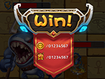
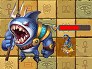
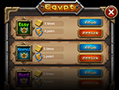
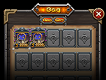
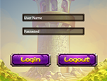
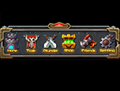
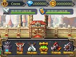
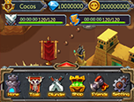
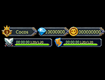
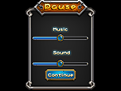

# 1.3 샘플과 듀토리얼들
###BattleResult

BattleResult씬에서 사운드 재생하기

[Download](res/BattleResult.zip)

###BattleScene

애니메이션과 TileMap기능 사용하기

[Download](res/BattleScene.zip)

###DifficultySelection

9 scale grid를 이용한 난이도 선택 인터페이스

[Download](res/DifficultySelection.zip)

###Inventory

컨테이너를 이용한 인벤토리 만들기

[Download](res/Inventory.zip)

###LevelSelection

PageView를 이용한 레벨 선택 화면 만들기

[Download](res/LevelSelection.zip)

###Login

기본적인 컨트롤들을 이용하여 로그인 화면 만들기

[Download](res/Login.zip)

###MainMenu

컨테이너들과 컨트롤들 사용하기

[Download](res/MainMenu.zip)

###MainScreen

MainMenu에 PlayStats 합치기

[Download](res/MainScreen.zip)

###MissionSelect

스프라이트 시트와 스크롤뷰 사용하기

[Download](res/MissionSelect.zip)

###PlayerStats

기본적인 컨트롤들을 사용하여 PlayStats 인터페이스 만들기

[Download](res/PlayerStats.zip)

###Setting

설정 인터페이스 만들기

[Download](res/Setting.zip)
