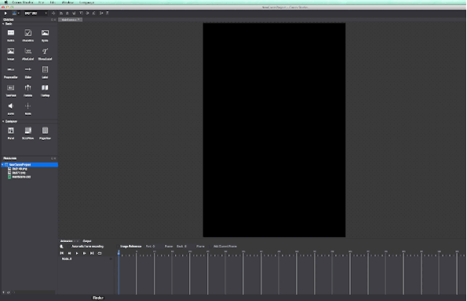
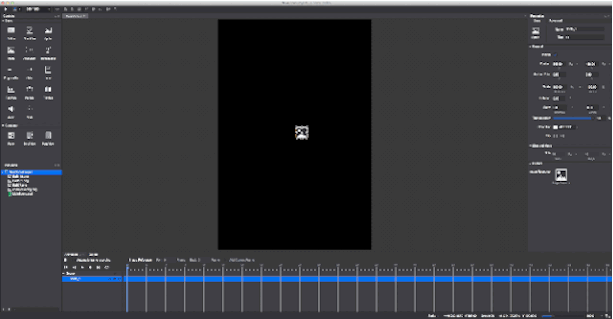

# 2.2.4 Import

Currently Cocos Studio supports asset types with pictures (.png .jpg), particles (.plist), spritesheet (.plist), fonts (.ttf .fnt), bitmap fonts(.plist), sound (.mp3) , maps (.tmx), Cocos Studio file (.csz)

####How to import Assets

(1) imported via menu

You can Cocos Studio menu - "Import", "File Import assets" or the asset panel menu items,import assets to a project manager.

(2) by drag ‘n’ drop

You can direct the assets on the disk by dragging the form of direct import to Cocos Studio assets panel, canvas, properties panel, animation panel.

(3) through the property change

When you modify property, assets will be imported to the project
