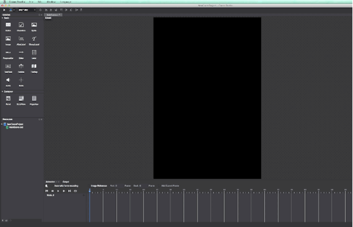

# 2.2.4 导入资源

您的游戏素材想要在Cocos Studio中使用时，需要使用导入资源功能添加到您的Cocos Studio项目中。

目前Cocos Studio支持的资源类型有图片（.png .jpg）,粒子（.plist）,合图（.plist）,FNT字体（.ttf .fnt）,艺术字体（.plist）,声音（.mp3）,地图（.tmx），Cocos Studio文件（.csd）

####如何导入资源
Cocos Studio支持多种形式的导入资源，您可以

(1) 通过菜单导入

您可以通过Cocos Studio的菜单“文件—导入资源”或资源面板菜单项”导入资源“，导入资源至项目管理器中。

(2) 通过拖拽导入

您可以直接将磁盘上的资源，通过拖拽的形式，直接导入至Cocos Studio的资源面板,画布面板,属性面板（对应属性）,动画面板上。

(3) 通过属性导入

您可以在编辑控件属性时，可以对控件的资源进行预览，并可以通过双击修改所引用的资源
