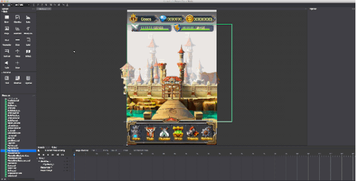
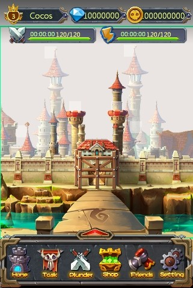
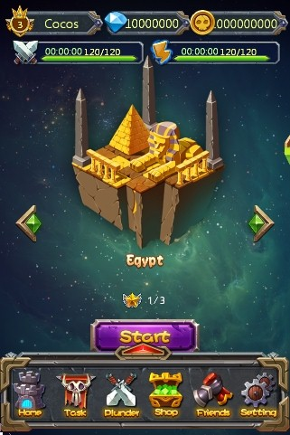

# 2.2.3 Reuse Scene

Scene, Layer and node can be reused

####When to reuse scene
Reuse scene is easier to manage, it can also reduce package size. We use the example of the two official sample to illustrate the advantages of scene reuse.

For example above scenes share some common elements we can easily reuse a layer to construct the common part of UI, avoid create it again.

Reuse scene can help you simplify game project a lot.

####Rules
1.Editing is limited (position, rotation, anchor point, scale)

2.Can’t change reused content 

3.Can’t create referencing loop

4.Create create multiple instance of the reused scene

5.Reused scene will update one the original scene gets updated

6.Export script will handle exporting reused scene
