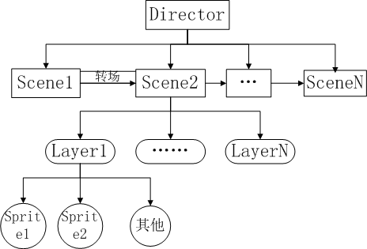

# 2.2.1 새로운 파일

코코스 스튜디오로 씬, 레이어, 노드, 스프라이트시트 네가지 파일 타입을 만들 수 있습니다.

파일명(File name): 파일명은 숫자와 알파벳으로 이루어질 수 있고 다음과 같은 문자는 포함될 수 없습니다 \ /: * "<> |;?

종류(Type): 만들기 원하는 파일 타입을 선택하고 클릭;

설명(Description): 파일 설명;

크기(Size): 레이어에서만 지원하는 캔버스 크기.

####씬 파일(Scene File)

씬은 Cocos2d-x의 핵심 요소로 레벨, 메뉴 등을 만들 때 사용합니다. 게임은 씬들을 통해 영화처럼 만들어집니다.

씬의 가장 중요한 역할은 게임의 흐름을 제어하는 것으로 게임을 완성하기 위해서는 여러개의 씬을 만들어야 합니다.

씬 파일은 씬 파일로서 저장됩니다.

####레이어 파일(Layer file)

스프라이트, 라벨 또는 게임의 다른 요소 등의 호스트로서 레이어를 사용하며 위치, 회전, 크기 등 이런 요소의 속성을 설정할 수 있습니다.

보통 게임 로직에 의해 레이어를 조직하고 눈에 보이도록 씬에 레이어를 추가합니다.

####노드 파일(Node file)

노드는 Cocos2d-x의 기본 요소로 노드의 요소는 노드 오브젝트이거나 또는 그 서브클래스여야합니다. 노드는 다음과 같은 주요 기능을 가집니다:

오브젝트는 다른 노드들을 포함할 수 있습니다;

스케쥴된 콜백 함수를 설정할 수 있습니다;

노드 파일은 저장된 노드를 사용하고 다른 파일을 재사용할 수 있습니다.

####스프라이트시트 파일(SpriteSheet file)

스프라이트시트는 하나의 커다란 스프라이트시트에서 파생된 작은 이미지들로 구성됩니다.

게임 개발자에게 아주 유용한 기능으로 성능을 획기적으로 향상시킵니다.

스프라이트시트는 1024 * 1024보다 작을 것을 추천하며 그렇지 않으면 어떤 디바이스에서는 문제가 발생할 수도 있습니다.

####파일 타입을 선택하는 방법

Cocos2d-x는 게임을 관리하기 위해서 씬 그래프를 사용하며 게임은 다른 씬들로 나눌 수 있습니다. 씬은 하나의 레이어나 다른 레이어들로 나누어질 수 있으며 레이어는 여러 개의 노드를 가질 수 있습니다.

디렉터는 씬의 전환을 제어하고 씬을 보여주는 역할을 담당합니다.

씬 또는 레이어를 만들던지간에 다음과 같은 가정에 기초할 수 있습니다. 로그인 장면이나 메인 인터페이스, 배틀 인터페이스 등 주요 기능을 위해 씬을 사용합니다.

캐릭터 속성이나 소지품, 앱스토어, 스킬 등과 같은 그래픽을 바꿀 필요가 있을 때 레이어를 사용합니다.

재사용 가능한 컴포넌트를 위해 노드를 사용합니다.

게임 성능을 최적화하기 위해 스프라이트 시트를 사용합니다.
