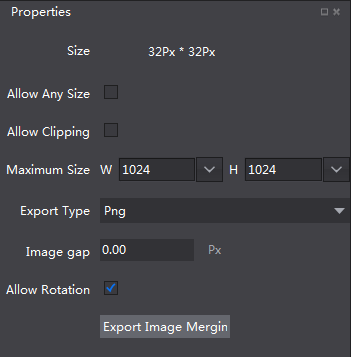

# 2.2.5 SpriteSheet

Cocos Studio can package spritesheet for you, we’re going to show how to do it here.

####How to use SpriteSheet
1. Add asset
    select the image asset, drag it to the canvas. Currently only picture type (.png .jpg) assets

2. Modify spritesheet properties
   
    Use Properties panel to modify spritesheet settings. 

    

    Property Description:

    Size: the size of the current spritesheet

    Customize Size: this option will ignore the power of 2 size limit, can use any image size 

    Trim: When checked, will automatically trim spritesheet to ensure size is minimized.

    Maximum size: spritesheet the maximum size allowed.

    Type: generated spritesheet file type.

    Gap: the gap between the elements.

    Can be rotated: allow rotate sprite to generate the best compressed spritesheet.

3. Delete asset
    Hit delete key or use right mouse menu

