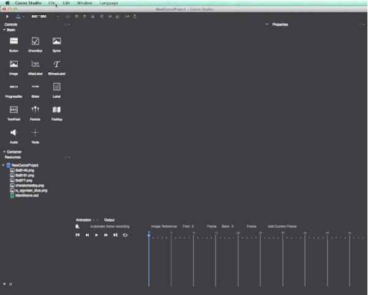

# 2.2.5 스프라이트시트(SpriteSheet)

코코스 스튜디오는 스프라이트시트를 패키지화할 수 있으며 그 방법을 소개하겠습니다.

####스프라이트시트 사용법

1. 에셋 추가(Add asset)
    이미지 에셋을 선택하고 캔버스로 드래그합니다. 현재 다음과 같은 이미지 에셋만을 지원합니다. (.png .jpg)

2. 스프라이트시트 속성 변경

    스프라이트시트 설정을 변경하기 위해 속성 패널을 사용합니다.

    

    속성 설명:

    크기(Size): 현재 스프라이트시트의 크기

    커스터마이징한 크기(Customize Size): 이 옵션은 어떠한 크기의 이미지를 사용하든지 사이즈의 한계를 무시할 수 있습니다.

    트림(Trim): 이 옵션을 선택하면 자동으로 스프라이트시트의 크기를 최소화하기 위해 트림합니다.

    최대 사이즈(Maximum size): 스프라이트시트가 허용하는 최대 크기.

    종류(Type): 스프라이트시트 파일 종류 생성.

    갭(Gap): 요소간의 갭.

    회전 가능(Can be rotated): 회전을 허용하는 스프라이트를 최고로 압축된 스프라이트시트로 생성.

3. 에셋 삭제(Delete asset)
    삭제(delete) 키를 누르거나 마우스 우클릭 메뉴를 사용
