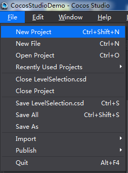
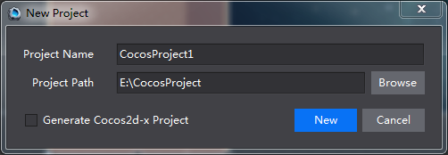
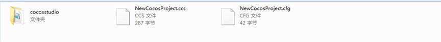
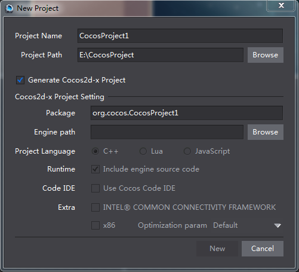
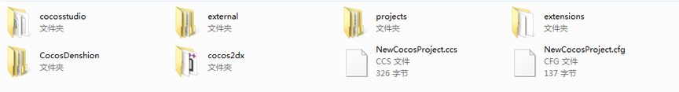

# 2.1 第一步：新建游戏项目

####项目
项目是一个将包含场景,图层,节点,合图,资源等文件组织起来的工程。Cocos Studio中可以创建包含源代码的项目也可以创建不包含源代码的项目。
####新建项目

启动Cocos Studio，来到登陆页，选择新建游戏项目。我们新建一个Cocos Studio官方示例项目，项目名称为“CocosStudioDemo”

 
在创建项目时只要设置好项目名称和路径，点击“新建”按钮，即可新建一个Cocos Studio游戏项目。在这里您可以制作游戏中需要使用的各种资源，从启动界面到注册登录，从游戏主场景到战斗场景，从装备背包到人物动画均可在Cocos Studio中轻松实现，并最终输出游戏资源给编程人员。

如果您是一位了解编程的Cocos用户，在使用Cocos Studio时，我们为您提供了直接生成Cocos2d-x源代码项目的方式

目录结构

 
其中cocosstudio文件夹放置您项目中使用的所有资源

XXX.ccs文件为项目的启动文件，双击该文件可以开启您的项目

XXX.cfg文件为项目配置文件，用于管理您的项目配置信息

####新建包含源代码项目
在新建项目界面，勾选“生成Cococs2d-x项目”，在设置好相关的参数后，即可创建一个既包含游戏界面，也包含游戏源代码的工程，当然在创建这些工程后还是需要相应的工具来进行源代码的编写，Cocos Studio将使界面编辑到代码编辑的流程更加通顺流畅。

 
代码项目设置包含以下内容：

包名：应用程序在设备（IOS,Android）中的唯一ID标识。
 
引擎路径：您本机的Cocos2d-x路径。这个属性很重要，一定要设置正确的引擎路径。目前Cocos Studio支持2.x-3.x版本的Cocos2d-x引擎，获得最新版引擎，请到Cocos2-x官方网站获取。

项目语言：C++,Lua,JavaScript

运行环境：您可以选择是使用Cocos2d-x的运行时运行程序还是通过源代码编译程序。

附件功能：附加功能是Intel 公司提供的针对C++的特殊优化功能。您可以根据项目的要求，选择是否增加这些附加功能。
Intel@Common Connectivity Framework是由Intel公司提供的一套通用连接框架，详细内容参见：https://software.intel.com/en-us/ccf。
X86优化是由Intel公司提供的一套适用于X86平台的框架。GCC（GNU Compiler Collection，GNU编译器套装）是一套由GNU工程开发的支持多种编程语言的编译器。ICC（Intel C++ Compiler）是 Intel 公司开发的 C/C++ 编译器。关于ICC详见
https://software.intel.com/en-us/forums/intel-c-compiler 

目录结构

 
其中cocosstudio文件夹放置您项目中使用的所有资源

XXX.ccs文件为项目的启动文件，双击该文件可以开启您的项目

XXX.cfg文件为项目配置文件，用于管理您的项目配置信息

其他文件为Cocos2d-x代码项目文件，如果您想使用编写代码的IDE启动您的项目，您可以访问projects文件夹下的文件找到对应IDE的启动项来启动您的项目。
