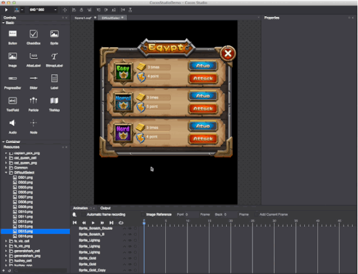

# 2.4.3 How to use 9-Slice

Use 9-Slice can help you save a lot of asset as well as bundle size, in the example, we use 9-Slice in different places, as this ui screen below:

Its yellow background is to use an image just 482 bytes, here is how we made it:

####9-Slice

(1) In the Property panel select using 9-Slice function (not every widget have this property)

(2) set central area of a 9-slice image

(3) modify the node content size.

####How 9-Slice work
When the four corners of 9-Slice scales it will extending in four directions, to reach the new position, and then stretched on both sides of the line of horizontal slices, vertical slice stretched left and right, and the middle will scale as normal.

Note: 9-slice only works with customized content size, also with enable 9-Slice enabled.
