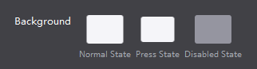
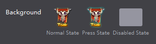
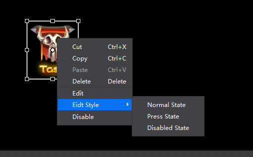

# 2.4.2 Edit Reference

In game development, set the node's art assets is one of the most basic action. Cocos Studio provides three ways to do it quick and easy. We’ll use the previous "Home" button to demonstrate how to do it.

####With property panel
In the node property panel, locate the node property value "background"

Double-click on the "normal state" icon in the pop-up dialog window, select the asset, click on "Open" to complete the attribute "normal state" asset.

####Right-click menu
Select button "Home" on the canvas, and right click

Select the menu item "Settings button style - pressed state", the same pop-up dialog window,select the asset to be set, click on "Open" to complete the attribute "pressed state" asset.

Some of the widgets supports right-click menu to quickly assign assets. (Cocos Studio will automatically copy any external files that’s not part of the project yet).

Nodes currently support this feature are: Button, Checkbox, Sprite, Image, Bitmap Font, FNT font, Progress bar, Sliders, particles, map, sound.

Please refer to how to use the nodes for more detail

####drag and drop assets
As usual, we can always drag and drop assets

1, drag and drop assets to canvas

2, drag and drop to properties

