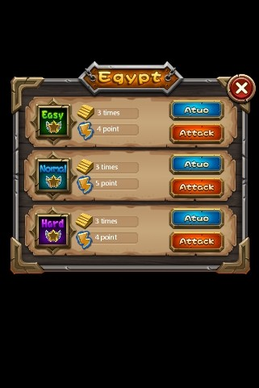

# 2.3 第三步：使用游戏控件

在Cocos Studio中，控件是构成游戏资源的基本单位，所有游戏场景的内容均是由控件构成，如在下图官方示例中难度选择（DifficultSelect.csd）界面中，我们就使用了多种控件，例如精灵控件（标题背景）,按钮控件(扫荡按钮，攻打按钮),图片(土黄色背景)等，在游戏中使用到的任何资源，您都可以选择相应的控件并为之设置属性，以实现自己所需的效果。

Cocos Studio提供了多种控件来帮助用户实现各种复杂的游戏场景，分别是：按钮,复选框,精灵,图片,艺术数字,FNT字体,进度条,滑动条,文本,输入框,粒子,地图,声音,元素,基础容器,滚动容器,列表容器,翻页容器。这些控件统一放置在控件面板内供用户使用。通过本节的学习，您可以了解这些控件的基本特性。

[游戏控件之间的关系](../relationship/zh.md)

[使用画布面板](../use-canvas/zh.md)

[游戏控件的位置和布局](../positions/zh.md)

