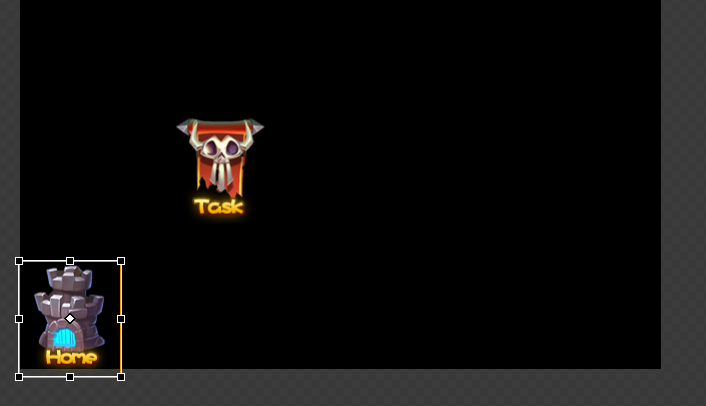
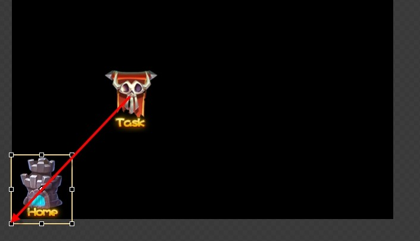
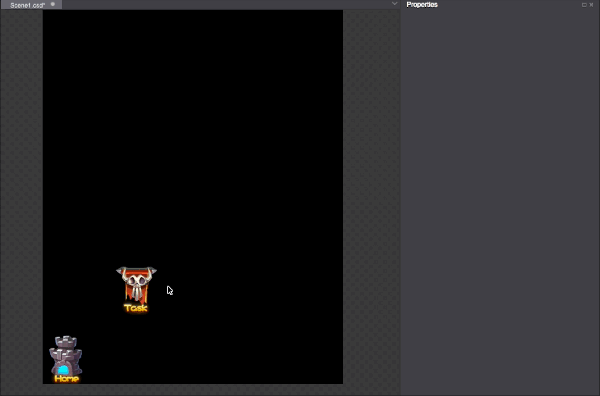

# 2.3.3 游戏控件的位置和布局

在Cocos Studio中，控件的坐标（属性）采用相对位置来表示，在不改变布局属性的前提下的规则为：控件的坐标数值表示该控件距离其父控件的左下顶点的坐标偏移量。举例来说 

新建一个场景（Scene）文件，向其添加两个按钮控件，并如上图所示分别设置图片资源，修改控件坐标为“首页”（50,50），“关卡”（200,200），效果和上图一致。“首页”的坐标（50,50）实际上是其相对于他的父对象场景（Scene）的左下顶点的坐标偏移量。 

为了更加明白的说明这个规则，我们在做个试验，调整两个控件“首页”和“关卡”的父子关系，将“关卡”作为“首页”的子对象（在对象结构树处修改）。这时您再看“关卡”的坐标会发现，坐标值由原来的（200,200）改变为（189,206）。套用上文的规则，“关卡”的坐标是他距离其父控件（首页）控件的左下顶点的坐标偏移量，因此很容易验证新坐标值的正确性，如下图所示： 

####游戏控件的布局

为了实现在不同分辨率下界面均可适配，Cocos Studio提供了新的布局方式，百分比布局。使用百分比布局操作十分简单，只需要切换控件坐标的单位为“相对父容器的百分比”后，按照百分比设置坐标值即可。切换的操作如下所示：

