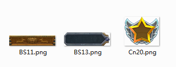

# 2.3.1 Scene graph

Scene graph is how node and widgets are organized.

 
In Cocos Studio, how to use the assets above to achieve the following

 
Pay attention to the order of nodes are positioned, the order in the scene graph affects the order of rendering.

 
Next we consider: how to rotate the whole head. simply select the parent node and rotate it,observe every child node follows, with this parent-child structure, it’s very easy to manipulate elements with a parent

 

####Parent-child relationship
When we first drag node A to the canvas, and then drag the node B to the A, we call for node A parent of B, B to A child node, node, node A and B for the parent-child relationship.

Similarly, with the scene graph: Drag node A to tree, and then drag the node B to the A, then you can see the node in the next level of A, B, we say A is the parent of B node, B of a's child node, node, node a and B for the parent-child relationship.
  
####Note:

1, change parent node will affect child node

2, child node can’t affect parent

6, alignment options only affects parent

