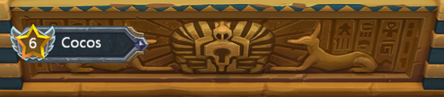
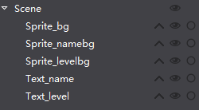
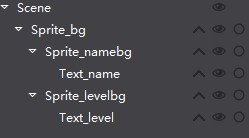

# 2.3.1 游戏控件之间的关系

我们知道游戏场景是由多个控件构成，这些控件之间存在一定的关系，以一定的规则互相操作，从而实现酷炫的游戏效果。

 
在Cocos Studio里，如何使用上述资源，摆放出下面这张图片的效果

 
仔细观察效果图，不难发现，整张图分成三层，从下到上依次是黄色背景,蓝色名称背景,星星等级背景。Cocos Studio遵循先放置先渲染的原则，即先放置黄色背景(BS11)，再放置蓝色名称背景(BS13)，最后放置星星背景（Cn20），即可实现上图所示下图。实现上图，我们需要按照下图来摆放这些资源。

 
接下来我们考虑：将相同内容的控件放置在一起，方便统一管理和操作。
设置父子关系，仅通过改变父控件的位置，就可以控制父子控件同时改变。我们将上面的结构改成下面这样，再看效果如何。

 
逻辑结构是不是更加清晰？ 

####父子关系
当我们先拖动控件A至画布，再拖动控件B至A上时，我们称控件A为B的父，控件B为A的子，控件A和控件B为父子关系。

同样，在控件结构树上操作时：拖动控件A至结构树，再拖动控件B至A上，这时可以看到控件B在A的下一层级，我们称控件A为B的父，控件B为A的子，控件A和控件B为父子关系。
  
####父子关系操作规则

1,	对父控件进行平移,旋转,缩放操作时，会影响子控件的渲染位置，但是父子控件的相对位置不变；

2,	对子控件操作，父控件不受任何影响；

3,	对父控件设置对齐方式时，子控件不受影响。如：对父控件设置左对齐，子控件不执行左对齐操作，仅与父控件的相对位置不变。

