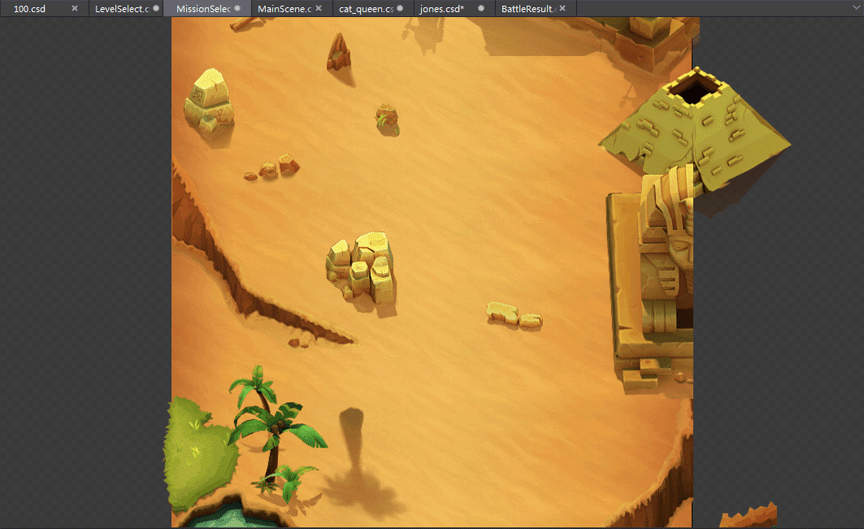
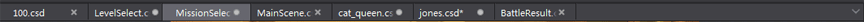
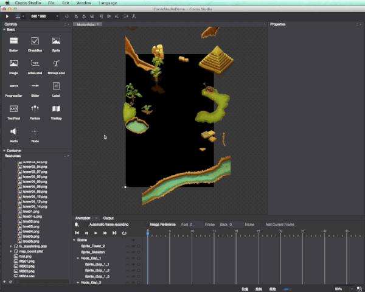
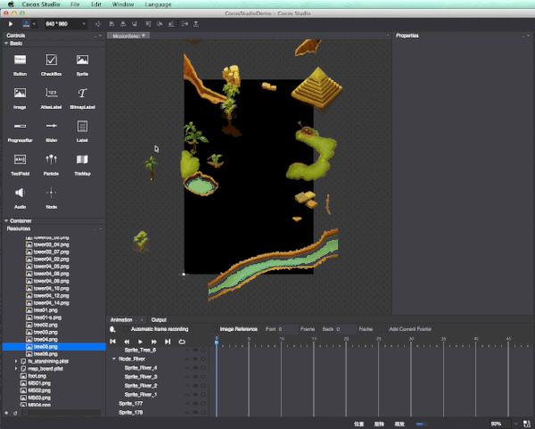
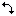

# 2.3.2 Use Canvas

Canvas is an important area of ​game production, you can edit the scene on canvas, adjust the nodes, preview, grasp the overall progress of the game.

You can create a new file or open an existing file, the currently open file will be displayed on the canvas, while in the previous file will remain in the tab, you can easily switch to a different file for editing.

It should be noted that, Unlike scene, layer, node. SpriteSheet can’t be manipulated on canvas.

####Adding nodes
For example add widgets to our sample (MissionSelect.csd) you can do the following

(1) dragged ‘n’ drop

a) Drag from asset panel

b) Drag ‘n’ drop project file (images, scene file)

c) Drag ‘n’ drop directly from folder

(2) right mouse

container node, you can use right-click menu

####Modify nodes
We have added the nodes, they will now set its position

1. single node editing

    For selected node the editing options are:

    Adding assets: Select the resource from the resource area, drag to node, release the mouse to complete the add

    Delete nodes: use delete key or right mouse menu

    Move: use mouse to move node around. Hold down the Shift for horizontal or vertical movement; you can also use arrow keys to move;

    Zoom: mouse nodes located eight vertices, when the mouse appears, click and drag to complete the scaling. Hold down the Shift supports proportional scaling;

    Rotation: the mouse is outside of the node of the four diagonal vertices appear when the mouse, click to rotate to the desired angle. Hold down the Shift supports a single rotation of 15 degrees;

    Skew: The mouse nodes located on four sides, when the mouse appears, click and drag to achieve skew;

    Anchor: the mouse is over the node anchor when the mouse appears, click and drag to change the anchor position;

    Right-click: Right-click on the node will display the context menu, all the nodes are "cut, copy, paste, delete" four basic items. There are different nodes at different special items.

2. multiple nodes editing

    There are two ways to select multiple node: 

    (1) Press cmd (Windows press Ctrl) while clicking multiple nodes, 

    (2) drag and hold the mouse to create a selection box
