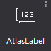
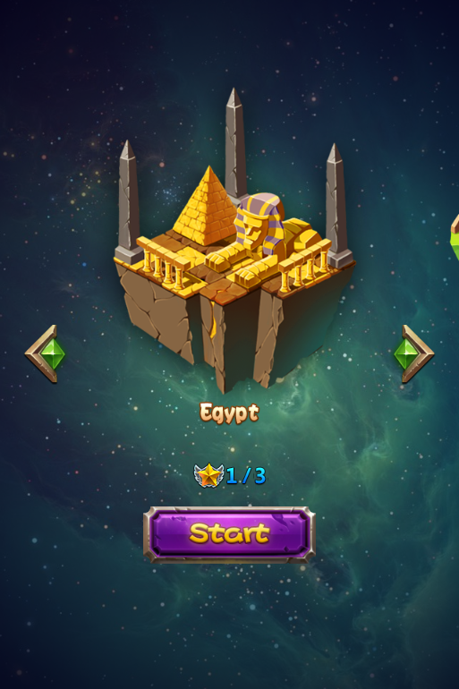
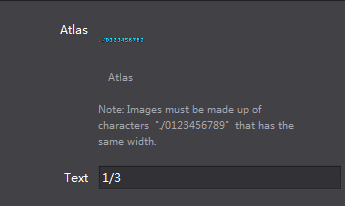
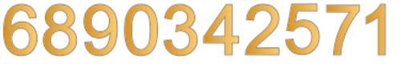
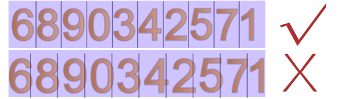

# 3.1.5 Atlas Label

 
 

Atlas Label is a simple label designed to display numbers, each number has the same height as the image, the width of 1/10 of the image, atlas label can be used to display numbers in game, It is a very simple visual effect.

atlas label compared to FNT fonts has the following features:
1 easy to make
2 limited functionality only supports number 0-9
 
#### Usage
Our official example, (SelectLevel.csd) make use of atlas label
  
 
 
#### Scenario 1: Modify the image resources for Atlas label
Adding an atlas label on canvas, select the atlas label, properties will display the current resource thumbnail, you can modify it by double-clicking a thumbnail, as well as drag image to it.
In addition you can also use right mouse.
When you modify the button text simply select the button, modify text attributes in the Properties, same can be done though right mouse.
  
 

 
#### Note:
When creating atlas label designers need to provide a game contains a "0" to "9" picture, make sure the order of 0-9 and image has to be even.
  
 

A typical atlas label image resources
  
  
 
If you need label other than numbers, please refer to [FNT font]().

