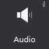
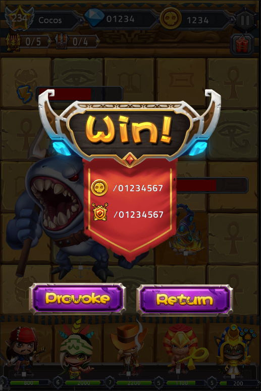
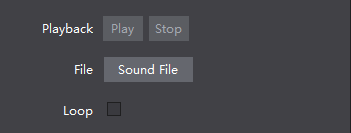

# Sound

Sound control music and sound effects. sound effects is crucial for how a game feels. Cocos Studio Sound widget supports mp3, wav audio file formats.

#### Usage

In the official victory interface example, we use the voice control to a victory sound, you can get the official view examples
 

#### Scenario 1: Import File

You can import a specific effect of a sound file (mp3 / wav file):

(1) Drag the file from the Resources panel to voice control, release the mouse that implementation file import;

(2) In the Properties panel "feature", click "Import sound files" button, select the file to import;

(3) Select the right choice particle controls on the canvas "Setting sound file" and select the file to import.

#### Scenario 2: Can you make sound loop
Check the features - the loop play "support", and in the actual game project will loop the sound file, when unchecked, the sound file is only played once stop.

