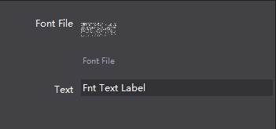

# 3.1.6 FNT Font

 
 

You can achieve a variety of artistic fonts by setting FNT font file.
Compare to Atlas Label, FNT font has the following features:
1 Support all kinds of text, following is an example of FNT fonts, support all characters even special characters.
2 Hard to create, requiring the specialized software.
  
 
 
#### Usage
 
 

#### Scenario 1: FNT fonts
Add a FNT on canvas, select the FNT font, property panel will display the current style resources, you can double-click or drag ‘n’ drop to modify the fonts.

In addition right-click menu also works.

To change the text, you can either double click, right click, or modify the properties.
  
 

When you enter characters that's not in the fnt file, these missing characters will be displayed as spaces.

