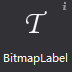
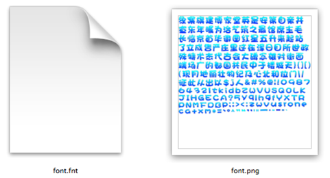

# 3.1.6 FNT字体

可以通过设置FNT字体文件实现各种艺术字体。
和艺术数字比，FNT字体具有以下特性：
1.	可用资源丰富，支持各类文字，下图就是一张制作好的FNT字体，不难发现，字体中包含中文，英文，数字以及某些特殊字符。
2.	制作复杂，需要使用专业软件进行制作。
 

#### 使用场景

 

#### 场景1：使用FNT字体
在画布上添加一个FNT后，选择该FNT字体控件，在属性面板的特性部分会展示该控件当前的样式资源，您可以通过双击修改按FNT字体的属性，也可以将FNT资源拖动到当前的样式资源上以替换为新的资源。
除此之外也能通过按钮控件的右键菜单添加新的资源。
修改FNT字体文本时只需选中控件，在属性区修改文本属性，也可以通过“菜单-编辑文本”或双击唤出修改文本弹窗。
 

当您在输入框中输入了FNT中缺少的字符时，这些缺少的字符会被显示为空格。
