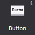
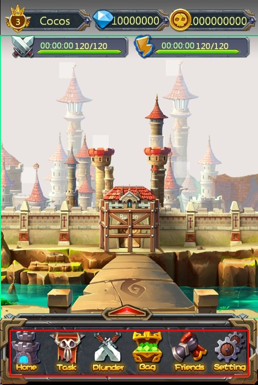
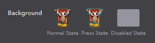
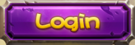
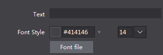

# 3.1.1 Button

Button is one of the most commonly used widget, response to the user clicks, it contains three states, normal, pressed and disabled, you can set the style and text for them.

#### Usage

Take official sample for example, the contents of the scene are composed by button

Even in your project, the user interface of level, diamonds, and coins can also be composed by a button widget, when the user touches, popup appropriate interface.

Button have a lot of properties, in addition to general properties, also includes some features properties and size properties, we will introduce you the button widget by several scenes that use button features.

#### Scenario 1: Modify button background, set the button pressed style and disabled style.
Button has three states; each state can be defined by an image.
To make the following button as an Example

You only need to add a button on the canvas, select the button, the feature properties panel will show the current button style, you can modify the properties by double-clicking the button widget, you can also drag the image to the property. We set up a normal state and a pressed state. When touch the button in the game, the button will automatically switch to the state picture. If necessary, you can also set the disabled state of the button. You can also replace resource by right-click the button.
 

#### Scenario 2: When using the buttons, you want to set the text on the button

Sometimes, after we set the button style, we also want to set the text of the button, you can use the Modify button text features. You can customize the color of the button text, font, and size.
When you modify the button text simply select the button, modify text attributes in the Properties area, you can also use right mouse or double-click the node to modify the text popups.

#### Scenario 3: In the game, the user does not want to touch the button in response to the event
Set the button as disable, while the button is disabled, in the final game will not respond to touch events.

