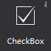
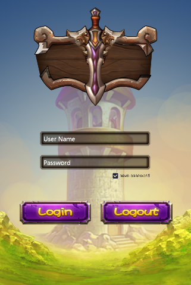
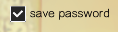
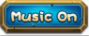

# 3.1.2 Checkbox

 
 

Checkbox is a widget that can be check or uncheck.
 
#### Usage
The most common place that the checkbox is used is on the login screen of the game as "remember user name" and "Remember Password"; I believe you often see.
 
 

It is also used in the setting interface in some games to switch the music or sound effects.
 
Checkbox widget has many properties, in addition to general properties, it includes some features properties, we will introduce you the checkbox widget by several scenarios that checkbox features are used.
 
#### Scenario 1: Modify checkbox style
Checkbox has five states: normal background style, background pressed style, background disabled styles, selected check style, selected disabled check style, each state can be defined with image.
If you want to implement conventional style check box, as shown below:
  
 
 
You can set the images of each of the five states to reach your requirements.
below is a ui for turn on/off music, and it’s using a checkbox:
  
 
 
You only need to set the background normal style, background pressed style, background disabled styles, and set the status of the other two are not enabled.
You can also replace resource by right-click the checkbox.
 
#### Scenario 2: The game defaults checkbox is checked (or not checked) .
When you set a checkbox selected, the checkbox’s initial state is selected. You can modify it through the properties panel or right-click menu
