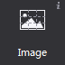
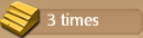
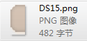

3.1.4 Image
 
 

Add an image with 9-slice property. 9-Slice is a way to stretch the image without make it look too distorted. About 9-slice usage, please refer to [how to use the 9-slice](../../../chapter2/properties/scale-9-slice/en.md).

Image widgets with respect to the Sprite widget, has the following characteristics:
1. can change the original size without image distortion.
2 By setting up different 9-slice values. You can use the same asset to achieve a different end result.
3 Image widgets cost more performance than sprite widgets; it is recommended not to overuse image widget.
 
#### Usage
Same with the official example of this interface, you can imagine what the place is composed by the Image widget?
  
 

Once you can get the official example, open the file to see how we DifficultSelect.csd use image widget, and perhaps will inspire your project.
 
One of the background is made by a size of 16x32 image. Here we show you how to use the image widgets make this background.

 

#### Scenario 1: How to use an image widget
  
 

After you add an image widget on the canvas, check its "image" attribute for the asset, it shows a thumbnails of assets, you can modify the widget by double-clicking the thumbnail, you can also drag the image onto the property to replace the current style for new assets. In addition you can also use right-click menu of 9-slice to add new assets.

Then open the "9-slice" property and modify the margins to 0,0,10,0, and then modify the widget size is 70,32, these margins will affect the 9-slice stretch the definition of the effect, and achieve the desired effect. About 9-slice principles and detailed instructions, see [how to use the 9-slice](../).

