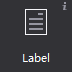
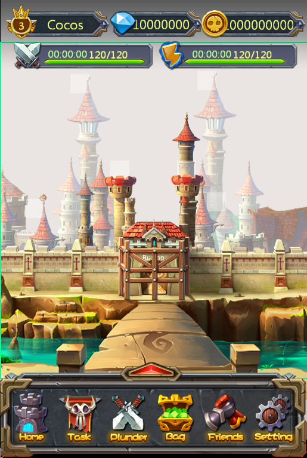

# Label

Label is also one of the most commonly used widgets in the game. Adding a text, you can set the font, size, alignment, and other styles or attributes.
 
 
#### Usage
In the example there are many Labels, such as the main menu:

 
#### Scenario 1: modify the text using different font styles
If you need a special font you need to import a TTF font, the font will be packaged and exported when you publish.
Note: when you not using the specified font, font will use the default system font for your games is the player’s default font of their device.