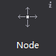
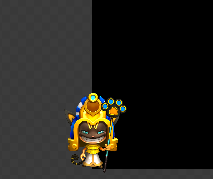

# Node

Node is the basic element of the scene graph, during game production, often need to create parent node to group other widgets . Node has three main features: the object can contain other nodes; You can set up a scheduled callback; can perform action.

#### Usage
In animation official example, we applied a lot of the effect of management node controls for linkage between multiple controls, you can get the official view examples:

