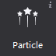

# 3.1.11 粒子

 

粒子是带有随机性特效的控件，是计算机图形学中模拟特定现象的技术实现：如爆炸,烟花,水流等效果。在游戏制作时，粒子可以制造酷炫的效果，使场景表现更丰富。

#### 使用场景
为了增加显示效果，游戏中很多细节都会使用粒子效果，在官方示例中，我们就在显示金币和钻石的位置，使用了粒子效果，以突出它们：

  
#### 场景1：导入并使用粒子
您可以为粒子导入特定效果的文件(plist文件)：
(1)	从资源面板拖动文件至粒子控件，松开鼠标即实现文件导入；
(2)	在属性面板的“特性”中，点击“导入粒子文件”按钮，选择文件导入；
(3)	在画布中选中粒子控件右键选择“设置粒子文件”，选择文件导入。

