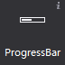
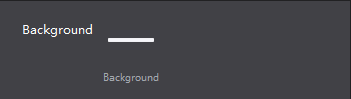
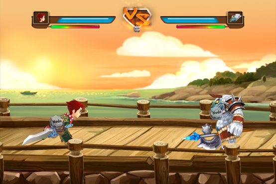

# 3.1.7 Progress bar

 
 

A progress bar is used to represent progression.
 
#### Usage
Official example, the HP bar is an example of progress bar, show on the screen shot as green bar
  
 

#### Scenario 1: Modify the progress bar style
Create a progress bar on canvas after adding a progress bar, select the progress bar, then double click or drag ‘n’ drop to change the assets for the progress bar.
In addition you can also use right-click menu to add new resources.
Here is an example of setting the background:
  
 

 
#### Scenario 2: Set the progress bar direction
 
 

HP bar shown above (one left, one right), only need to set the properties of the "type" of the progress bar, were set from left to right, right to left, by changing the direction of the progress bar.

