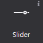
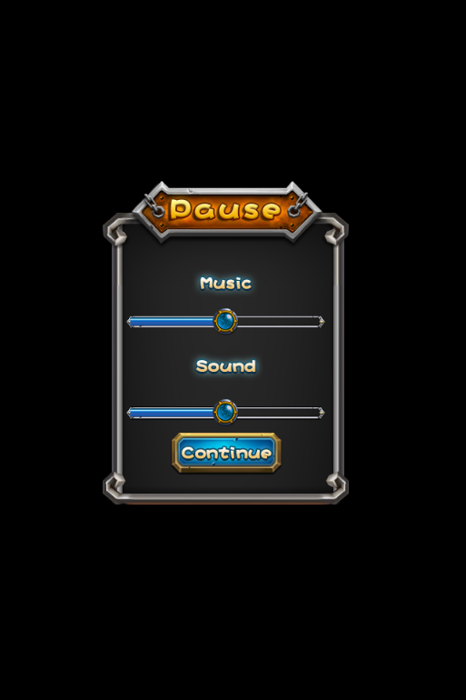
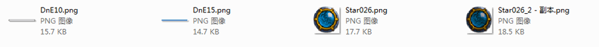
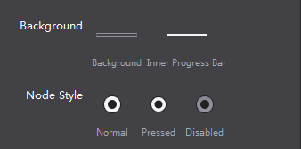

# 3.1.8 Slider

 
 

User can slide by moving the slider to display the corresponding value in the corresponding control
 
 
#### Use Scene
Slider is great for adjust attribute while observe it’s change, such as setting the volume, etc., in the official example, we also have them in the setting screen:
  
 

 
#### Scene 1: Modify the slider style
To create a slider, you need 5 images, we didn’t set the disabled state in this example
  
 

Add a slider on the canvas, select the slider, and use double click or drag and drop to replace the images.
  
 

In addition you can also use right-click menu to add new resources.

