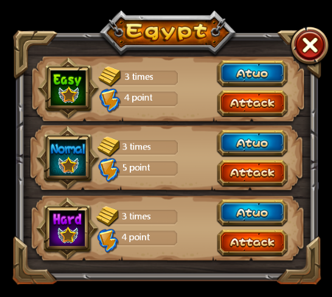

# 3.1.3 Sprite

 
 

Adding a Sprite widget, you can import pictures resources. Compared with Image widgets , the Sprite widget has the following characteristics:
1. Sprite does not have scale-9-grid properties, but it has higher performance, often used to set the game in most pictures resources.
2. Cocos Studio sprites are often used to make flipbook animation.
 
#### Usage
Sprite widget is used very frequently, here is an example, can you point out think of which are sprite?
 
 

After you get the official examples, open the file to see how we use sprite widgets in DifficultSelect.csd. Perhaps it will inspire your project.
 
#### Scenario 1: When to use the sprite widget
The sprite widgets composes borders the figure above, why? There are two reasons:
1. Reduce game resources.
2. Reuse resources.
Border stitching on the map, we only use the following resources:
 
 

After adding a sprite to the canvas, select the sprite, in feature section, the property panel will show the current resource thumbnail, you can modify the resources by double-clicking a thumbnail picture, you can also drag picture onto this property.
You can also through the properties panel or right-click menu to replace image.

