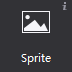
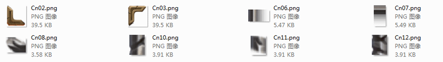

# 3.1.3 精灵

   

添加一张精灵控件，可导入图片资源。精灵控件和图片控件比，具有以下特性：
1.	不具备九宫格属性，但其性能开销低，经常被用来设置游戏中大部分图片资源。
2.	在Cocos Studio中精灵也常被用来做序列帧动画。

#### 使用场景
精灵控件使用十分频繁，我们给出一张官方示例中的界面图，您能想到哪些是由精灵控件组成的么？

 

您可以获取官方示例后，打开DifficultSelect.csd文件查看我们是如何使用精灵控件的，也许会对您的项目有所启发。

#### 场景1：何时使用精灵控件
上图中，窗口的边框都是由精灵控件组成的，为什么要这样做？有以下两个原因：
1．	节约资源浪费，减少资源大小。
2．	从复用做起，游戏中不同大小的窗口，均可使用同一套资源拼接。
拼接上图的边框，我们只使用了如下资源：

  

在画布上添加一个图片后，选择该图片控件，在属性面板的特性部分会展示控件当前的图片资源缩略图，您可以通过双击缩略图修改控件的图片资源，也可以将图片资源拖动到当前的样式资源上以替换为新的资源。
除此之外也能通过图片控件的右键菜单添加新的资源。
