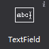
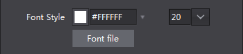
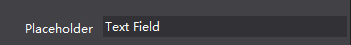
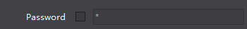

# 3.1.10 输入框

 

输入框可以让用户输入输入框信息，您可以设置输入框的字号,字体,密码模式,长度限制,输入框等属性
 

#### 使用场景
在游戏登录时我们设置的账号,密码，在交易时输入的金钱等都使用了输入框控件，在官方示例的登录界面中，我们就使用了输入框控件：
  

#### 场景1：修改输入框输入的字体
使用输入框时，我们也可以为输入的内容设置需要的字体，如果您需要特殊的字体则需要点击导入字体输入框导入一个 TTF格式的字体，这个字体将在您发布游戏时一起打包。
 

在修改输入框的字体时需要注意，当用户没有指定使用的字体时，用户使用的字体是所运行设备的默认字体，对于您所制作的游戏来说就是玩家设备的字体。

#### 场景2：添加占位文本
所谓占位文本，就是在玩家还未输入的状态时所展示的默认文本。您可以快速的通过属性“站位文本”来设置您需要的内容，如在示例中，我们使用“User Name”作为占位文本
 

#### 场景3：在输入密码时，用“*”代替用户输入的内容
输入密码时，通常都会用其他字符替代输入的内容，以保护账号安全。输入框控件提供了属性“显示密文”来方便您使用这个功能，并且您可以自定义显示的密文通过哪个符号代替，默认是“*”
 

#### 场景4：限制输入文本长度
输入框可以限制文本长度，在属性面板中打开长度限制，并指定输入框可输入的最大长度。

