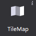
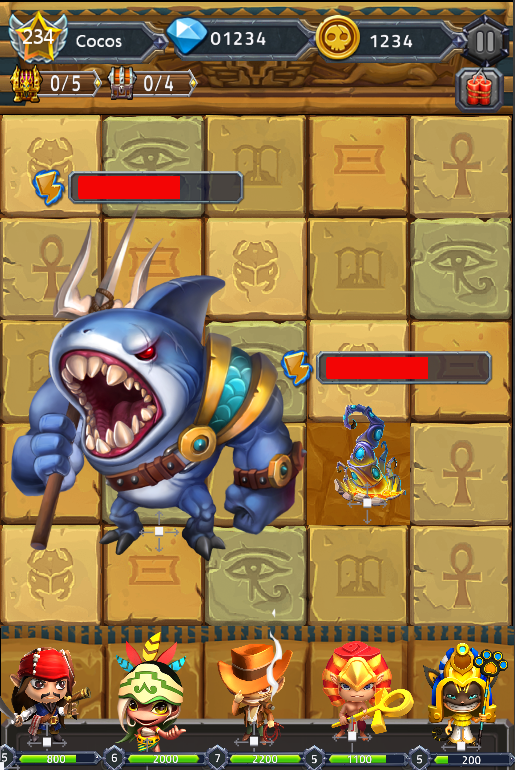

# 3.1.12 地图

地图控件可支持导入TMX格式文件，地图是制作游戏关卡地形图的控件，对于即时战略类型游戏的制作，为了使玩家流畅的切换游戏画面，经常会使用超过屏幕尺寸的地图。如果选择使用不用的背景图片切换场景，不仅造成资源浪费，加载速度也会变的很慢。
	
地图控件很好的解决了这一问题：采用瓦片地图的形式。一张大的背景图由几种地形表示，每种地形对应一张小图片，即瓦片，把这些瓦片拼接起来，就组成了一个完成的地图。对一些不同地形的场景切换时，只需加载瓦片，大大提升效率。

#### 使用场景
	
在官方示例的战斗场景中，我们使用了地图控件作为背景，即节约了资源，又提升了效率：

#### 场景1：导入并使用地图文件
您可以为地图控件导入特定效果的文件(TMX文件)：

1. 从资源面板拖动文件至地图控件，松开鼠标即实现文件导入；
2. 在属性面板的“特性”中，点击“导入地图文件”按钮，选择文件导入；
3. 在画布中选中地图控件右键选择“设置地图文件”，选择文件导入。