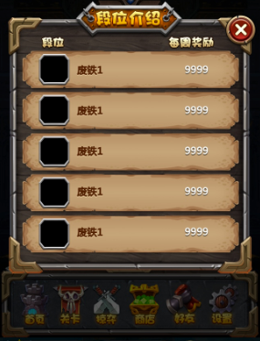

# 3.2.3 ListView



ListView can auto-arrange widgets quickly. 

**Attention: The position cannot be modified when a widget is added into ListView. **

#### Usage

ListView is often used in game scenes where list effects are needed. 



#### Scene 1: Do not display contents out of the ListView.

Anything placed out of ListView can be hidden by selecting “Cliping”. 

#### Scene2: How to add widgets into ListView.

When widgets are added into ListView, they will be arranged automatically. By setting features such as Scroll Direction, Alignment and Gap, positions of widgets inside ListView are settled. A ListView is thus created in horizontal or vertical direction. 
