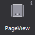
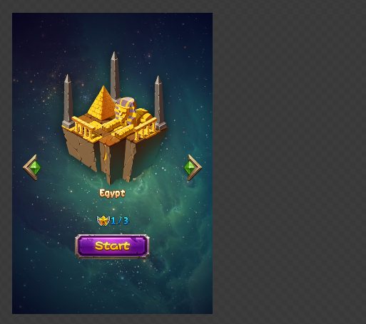

# PageView

PageView is a container with a page flip effect, can only add basic container.
 
#### Usage
PageView often used in game scenes like inventory with page flip effect, the official example, we use PageView in level selection screen, player can paging between different levels.
 

#### Scenario 1: If you do not display the contents of the container outside
When the page content is better than the pageview, which is most the case, you can use attribute "clipping" so the pageview will trim its content. As shown above, after we check the properties, the effect is as follows:

 

#### Scene 2: How to add flip effect
First you have to create pages for PageView to paging through, you can create page by right click on a PageView. After you created a page, you can add different widgets to the each page.

