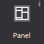
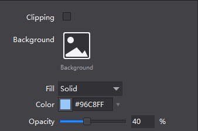
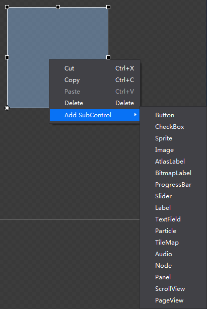

# Panel

Panel can be used to control child element's layout, also has handy features like clipping, fill color or background image
 
#### Usage
In the official example, we make extensive use of the panel to manage the layout, such as the main menu, user name, diamonds and gold they all have Panel, in order to ensure a relatively uniform layout:

#### Scenario 1: If you do not display the contents of the container outside
When you want to hide the content that’s bigger than the panel, you can use attribute "clipping" so the panel will clip the content

#### Scenario 2: Set the background fill a container and fill effects
There are two options to fill the color: solid color background, gradient background. You can choose color and set the opacity of the background; When you select a gradient background, you need to set the starting color and ending color, and opacity can be set separately for these two colors.

#### Scenario 3: quickly add child controls
In canvas, right after the selected widget, you can add all types of widgets as his child.

