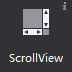
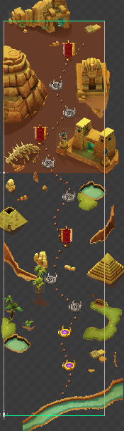
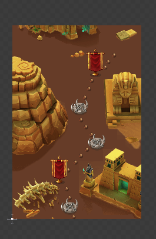
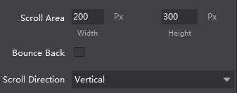

# ScrollView

ScrollView shows scrolling effect on the touch screen, it has the ability to set the scroll area, scroll direction and other attributes.
 
#### Usage
In the official example, we implemented scrollview in task selection screen (MissionSelect.csd), player can scroll the background. We set the height of the background about triple the size of a screen, so user can slide up and down the screen to view the entire map.

#### Scenario 1: If you do not display the contents of the container outside
When the scrolling content is better than the scrollview, which is most the case, you can use attribute "clipping" so the scrollview will trim its content. As shown above, after we check the properties, the effect is as follows:

#### Scenario 2; How to set the size of the scrolling content

In a word, scrolling content size has to be bigger than the scrollview for the scrolling to work
You can select the desired scroll direction: horizontal, vertical or both.

#### Scenario 3: How to Set the rebound effect
Slide the screen after reached border, continues to slide, the interface will have a rebound effect. To achieve this effect, you only need to check the scroll attribute container control "rebound effect", the system will be for you to achieve this effect in the game.

