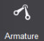
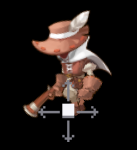
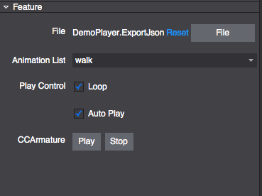

# 3.1.15 Armature

Armature widget supports:

- Importing animation files created by Cocos Studio v.1.x; 
- Switching the animation list; 
- Setting  the play mode: Loop & Auto Play; 
- Previewing the animation in the editor. 

#### Armature widget Tutorials

#### Scene 1: Importing and using animation files exported from v. 1. x. 
To import previously edited animation files (**.ExportJson*) into Armature widget, do one of the following: 

1. Drag and drop the selected file(s) from Resource panel to the properties section of the Armature widget; 
2. In the Properties panel, choose Base> Feature > File, and select the file(s) you want to import; 
3. In Canvas, right-click the Armature widget, choose "Select Armature File", and select the file(s) you want to import.

#### Scene 2: Animation playing options: 
You can do the following:

- Select the animation list for the current Armature widget;
- Set the animation playing mode into “Loop”;
- Set the Armature widget to play automatically when preview. 

