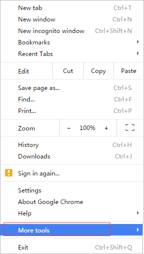
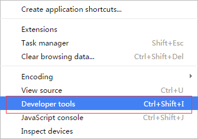

#How to Debug on Browser 
For a JS project, after clicking “run in the browser”, these may appear something wrong with the preview effect. This tutorial aims to help you solve this problem with the following two methods. 

1.	Drop the scene files used in the current browser to the list of JS projects src/resource.js. For example, 

Original resource.js:

 

 Modified resources. js: 

 

 Drop the resources of current scene to g_resources=[...].

2.	Enable “developer tool”, find the bug according to log. 
Chrome:
Customize and control -> More tools -> Developer tools

   
   
360 Browser:

Tools -> Developer Tools
 
Firefox:

Settings -> Developers -> Browser Console -> JS
  

 

