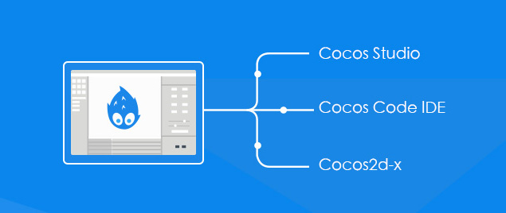

# 1.1 家族成员

Cocos整合了Cocos2d-X,Cocos Studio,Cocos Code IDE等框架及工具，为开发者提供了全套的游戏开发解决方案。后续还会开放接入更多的第三方工具和服务，简单易用,使用流畅。

- **Cocos2d-x：**

Cocos2d-x是基于OpenGL ES的跨平台开源引擎，现为全球占有率第一的手机游戏引擎，被媒体成为“千万级手游摇篮”。游戏开发快速,简易,功能强大。Cocos2d-x核心优势在于允许开发人员利用C++,Lua及Javascript来进行跨平台部署，覆盖平台包括iOS,Android,Windows Phone,黑莓（BlackBerry）及Tizen等等，省事省力省成本。

- **Cocos Studio：**

是Cocos2d-x引擎配套的跨平台游戏开发工具，帮助开发者快速构建游戏场景,编辑UI,编辑动画等游戏资源，支持第三方的资源导入。
支持多种类型游戏的编辑，满足不同开发者和公司的开发需求，并且上手容易，简单易懂，同时提供了丰富的技术支持和开发资源。

- **Cocos Code IDE：**

Cocos Code IDE 是一个基于 Eclipse 的跨平台 IDE，专门为 Cocos2d-x Lua & JavaScript 开发人员准备，通过 IDE 你可以方便的创建游戏工程,编写并且支持在不同平台上调试代码,实时查看代码被改变后的效果，最终直接发布成一个可上架的安装包。

