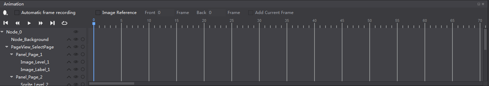
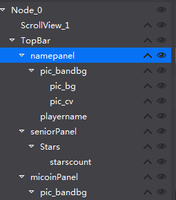
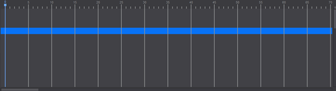

# 3.1.1.5 动画面板

动画面板分为四部分，对象结构树,时间轴,动画控制工具,动画编辑工具。

#### 对象结构树

对象结构树包含当前文件游戏使用的所有控件如按钮,地图,声音,粒子等等，它与画布面板中显示的控件一一对应，将控件面板的控件直接拖动到对象结构树中即可添加相应的对象到该位置（同时在画布面板上被渲染），该结构树提供了一个可视化的调整文件中的控件结构的方式，通过对象结构树，可以添加控件,删除控件,调整控件渲染顺序，调整控件父子结构(见下文)的功能。

您也可以在对象结构树上设置某个控件在画布面板是否隐藏，或锁定该控件在画布面板的编辑，但在对象结构树的面板中不论锁定还是隐藏，都只会影响画布面板的显示或编辑的效果，这个效果不会输出到最终的游戏中，如果您需要对控件的显隐,是否接受交互在游戏最终效果上有所调整请在属性面板修改控件的属性。

#### 父子结构

Cocos Studio采用父子结构这一概念，使任何对象成为另一对象的子对象，将欲移动的子对象拖动到目标的父对象中即可建立父子关系，子对象会继承父对象的移动,旋转路径，需要注意的是子对象并不会继承父对象的不透明度和颜色叠加属性。

#### 时间轴

Cocos Studio对每个文件提供一个动画时间轴，在该时间轴上可以添加关键帧，编辑器将自动在两帧之间添加动画曲线，以实现动画效果。

#### 动画控制工具

动画控制工具能够控制当前时间轴上的动画是否播放。

#### 动画编辑工具

动画编辑工具提供了一些编辑动画时常用的操作：

添加帧：点击后会在时间轴上您选中的位置上添加一关键帧。

自动记录帧：点击后您所做的变化会被记录在当前帧，成为关键帧，通过在不同的帧上修改控件的属性，即可创造出丰富多彩的动画效果

镜像参考：镜像参考又称洋葱皮，能够以当前帧为基础，将当前帧前后的帧通过线框的形式展现出来辅助动画编辑的操作。

