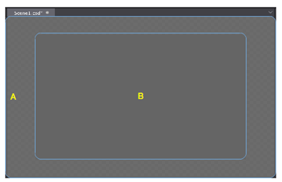

# 3.1.1.4 Canvas

### Note: Canvas panel will automatically adjust itself according to contents on it. 
####1) Display 2D canvas when editing 2D scenes and resources.

Canvas is the most commonly used panel in Cocos Studio, you can visually adjust the position, rotation, scaling, anchor point of a widget. you can also adjust widget properties using property panel.

Area B representatives the resolution size you set.

####2) Display 3D canvas when editing 3D scenes and resources. 

Users can visually adjust the position, rotation, scaling of a 3D widget. Left-button drag-and-drop features are limited to the selection of left mouse buttons group on Toolbar. Camera preview is displayed in a red box as the picture shows. 