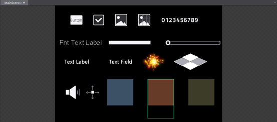
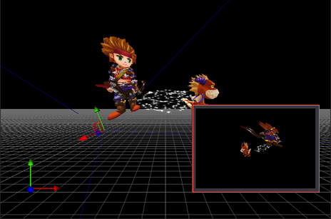

# 3.1.1.4 画布面板

###注意：此面板根据编辑内容不同而动态调整
####1）当编辑2D场景和资源时，显示2D画布

画布面板是Cocos Studio中最常使用的面板，在该面板中可以进行控件的位置,旋转,缩放的调整以及对控件锚点的修改等操作，在画布面板中可以单选或多选控件，选中后通过右键菜单或属性面板可以对控件进行进一步的设置。

按住空格，鼠标拖动空白处可以对画布进行移动。

画布面板的B区域代表了您所设置的分辨率大小。

####2）当编辑3D场景和资源时，显示3D画布

在该面板中可以进行3D控件的位置,旋转,缩放的调整等操作。此处鼠标拖拽功能由工具栏中的鼠标左键状态按钮组的选择决定。图中红色框内显示摄像机预览内容。