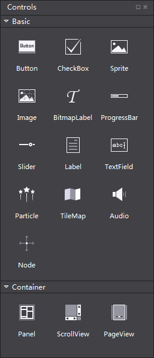
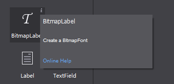

# 3.1.1.2 对象面板

对象面板分为基础对象,控件,容器,自定义控件两部分，包含了Cocos Studio提供的所有控件，通过拖动控件到画布面板或对象结构树可以实现添加一个控件的操作。

###控件面板会根据编辑内容不同显示不同内容

####1. 编辑2D场景时，显示如下

####2. 编辑3D场景时，显示如下

3D状态下的控制面板仅显示3D控件。如，3D摄像机，模型，3D粒子等。如上图所示。

无论在2D状态和3D状态下，控件面板中鼠标悬停时在控件图标上会在右上角出现一个“i”按钮，点击按钮会出现有关这个控件的描述信息，并提供一个扩展链接以打开浏览器获取更多关于这个控件的帮助信息。如下图所示。

