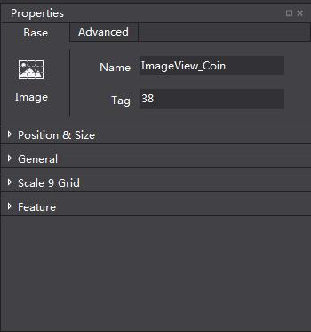
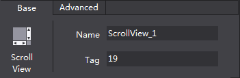
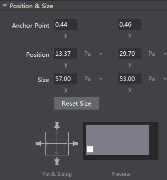
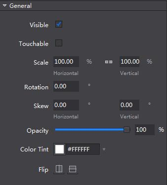
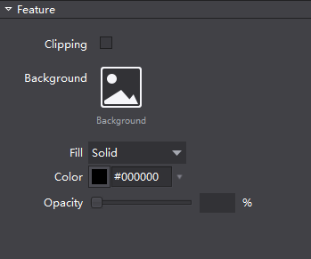
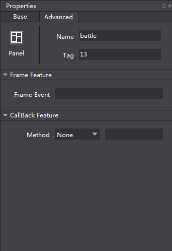

# 3.1.1.6 属性面板

属性面板展示了控件的所有属性，您可以进行调整和修改。

顶部是固定的标题区，属性面板有两个页签，包含基本属性和高级属性。基本属性部分分为位置与尺寸,常规,九宫格,特性几个部分，高级属性部分包括帧事件的设置和回调属性的设置。当您在画布面板选中了一个或多个控件时属性面板会出现相应的属性，可以通过输入数值,添加文件等方式调整。

标题区域：标题区域展示了当前选中的控件类型，您可以通过定义的名称或逻辑标签在程序中定位当前的控件。

#### 位置与尺寸属性

位置与尺寸属性包含了关于锚点,位置,尺寸的一些常规设置。除此之外，还设置了自适应布局功能，在调整分辨率时，图中的所有控件都能够自动改变。中间的PageView还能根据屏幕大小自动调整尺寸（竖向大小固定，横向大小与屏幕宽度成固定比例）。 

#### 常规属性

常规属性包含了一些控件的基础设置，如可见性,旋转角度,翻转等，大部分控件的常规属性是统一的，但也有一些控件有特殊情况，请参考如何使用控件。

#### 九宫格属性

九宫格属性可以给控件指定一个九宫格以确保控件拉伸但是不变形，这部分可以参考根据资源自动调整尺寸和如何使用九宫格。

#### 特性

特性属性对于不同控件有不同的设置功能，如图片,按钮等。图示为容器控件的特性设置。

#### 高级属性

高级属性主要包含了一些不常用的内容，包括设置帧事件和设置回调属性。回调属性可以直接在编辑器里边指定某个控件的事件的处理函数，不再需要逐个去get控件。

