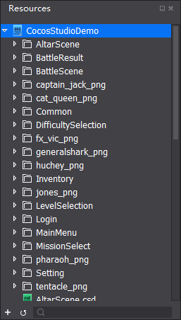
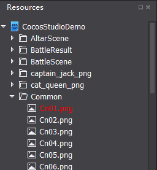

# 3.1.1.3 资源面板

资源面板是游戏项目中所有文件的展示面板，实现基本的新建,重命名,删除文件等功能。

在Cocos Studio中可以通过导入功能将资源导入到资源面板进行管理，也可以将资源通过资源面板拖动到其他区域，以完成资源工作流程。

特别说明：资源面板所展示的文件结构和磁盘上的文件结构是一致的，当您在磁盘上删除一个文件时，已经引用这个资源的控件会显示资源丢失样式。如下图标红文件：

