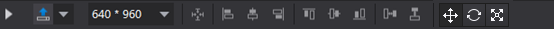
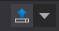
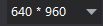
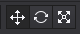

# 3.1.1.1 Toolbar

The toolbar contains five basic components: Preview, Publish, Resolution, Alignment  and left mouse button-group.

Preview, Publish - preview the project, publish project

Resolution - set the resolution of the current project as well as to switch the current screen orientation of the project

Alignment - align select elements on the canvas,

#### Notes: Left mouse button-group will display when editing 3D scenes; 
Left mouse buttons group includes 3 options: Position (change widgets’ position), Rotation (rotate the selected widgets) and Scaling (change widgets’ size). The drag-and-drop functions vary from the 3 options. Users can select each function by clicking corresponding button. The default option is Position. 

