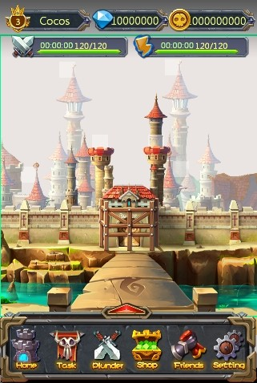
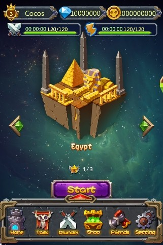

# 3.2.2.3 文件之间的嵌套

前一节介绍了Cocos Studio游戏项目可创建的文件类型：场景,图层,节点,合图，其中场景,图层,节点文件间可以嵌套,混合使用。

####什么时候需要进行文件嵌套
使用文件嵌套能够提高资源的重复利用率，减少安装包大小，方便后期维护。我们用官方示例中的两个节目来说明下文件嵌套的优点。

例如上图中从左至右分别是游戏主界面和关卡选择界面，仔细观察不难发现，两张图的顶部和底部内容和布局基本一致，我们有两种办法处理：一种在制作这两个图层时分别制作每个细节，另一种是抽出公共内容（顶部和底部），单独做一个图层，然后在制作这两个图层时，嵌套使用公共图层。这种做法显而易见，减少工作成本，提高可维护性，降低资源使用。

灵活的运用文件嵌套，会给您的项目带来很大帮助。

####文件嵌套规则
1. 被嵌套的文件，在目标文件内以CSDFile类型表示，CSDFile类型支持控件的基本属性(可见性,坐标,锚点,缩放,旋转)和操作，可以编辑；
2. 被嵌套的文件在目标文件内使用时，效果与源文件保持一致；
3. 文件不可循环嵌套。例：有A,B,C三个文件：A嵌套B，B嵌套C，那么C不可以嵌套B，C不可以嵌套A，B也不可以嵌套A。
4. 同一文件可以被多次嵌套在某文件内。例：有A,B两个文件，B文件可以被多次嵌套在A内（多个位置）。
5. 被嵌套文件在更新内容并保存后（包括修改文件自身信息如名称位置等），使用该文件的目标文件内容会及时更新同步。
6. 含有嵌套文件的文件在导出,导入,另存时，嵌套文件将一并操作。

####关于嵌套文件的动画
Cocos v2.1.0开始，外部文件支持控制嵌套文件的动画播放。相关的属性可在嵌套节点的特性属性栏进行设置：  
  
这个是动画类型属性，只能作为动画帧被记录在动画面板中：  
  
同时对于这个嵌套动画有如下两个约束:  
1,嵌套动画生命周期不得大于外部动画生命周期，在动画面板拖动,播放,模拟器播放都满足此约束。即外部动画停止，嵌套动画也跟着停止。   
2,嵌套动画播放时间上（帧率，非播放速度）与外部动画一致，在动画面板拖动,播放,模拟器播放都满足此约束。即外部动画走一帧，嵌套动画也走一帧。 
