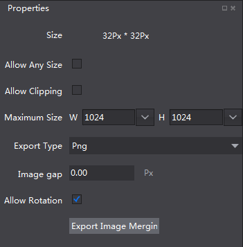

# 3.2.2.5 编辑合图

使用Cocos Studio的合图功能，您可以随时将零碎图片导入合图中，也可以随时更改已有合图，而不需要重新对这些调整过的资源进行重新引用。我们以示例项目中的资源为例为您演示如何使用合图功能。

####合图用法
1. 拖拽添加资源

   a) 在项目管理器选取图片资源，拖拽至画布面板。目前仅图片类型（.png .jpg）资源

   b) 从磁盘目录选取图片资源，拖拽至画布面板。目前仅支持图片类型（.png .jpg）资源 

2. 修改合图属性
   
	可通过属性面板修改合图类型文件的属性。 

	

	属性说明：

	尺寸：当前合图的尺寸，该属性随其他属性改变而改变。

	任意尺寸：勾选后合图的尺寸会根据素材的实际占用尺寸为准，不勾选的话，尺寸仅支持2的N次幂的尺寸。

	自动裁切：勾选后，会自动将合图的边缘进行裁切，保证合图尺寸最小化

	最大尺寸：合图允许的最大尺寸，如果素材过多，超过了合图的最大尺寸，那么多余的素材将会被排除在合图内。

	类型：生成合图文件的图片类型。

	间隙：素材和素材之间的间隙，该属性可以避免素材重叠。

	可旋转：勾选够，素材会根据算法要求，自动旋转至最佳角度参与合图。

	导出合图：可以导出已经编辑好的合图，查看合图文件是否合理正确。

 
3. 删除碎图资源

   有两种方式：(1)点击键盘“Delete”键，(2)右键选择“删除”。

