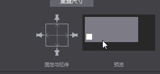
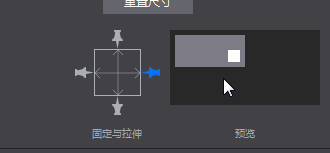
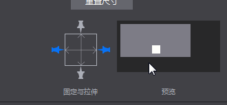

#3.2.4.5 自适应布局
市面上现有的手机的分辨率,长宽比有很多种，为了能够在不同的手机上都能得到好的显示效果。可以使用自适应布局来调整控件。  
自动布局系统主要涉及固定与拉伸属性：  
  
如图，总共可以修改控件的上下左右四个图钉和中间的两个拉伸条六个属性。  
####效果
当打开其中的任意一个图钉时，当前节点与父节点的对应边的距离即被固定。当父节点的大小修改时，当前节点与父节点对应边的距离总是不变。  
    
当打开其中的任意两个相对的图钉时，当前节点与父节点对应的两边的距离成固定比例。即当修改父节点的大小时，当前节点到父节点对应两条边的距离之比总是不变的。  
  
当开启中间任意一条拉伸条，如横向拉伸条，节点的宽度与父节点的宽度之比固定不变。  
  
####其他
不开启上述任意属性时，对象默认相对左下角位置不变。
仅控件和容器两种类型有拉伸条属性。  
此外在Cocos2d-x中需要设置加载出来之后的界面对象的尺寸信息，并作为参数传入ui::Helper::doLayout()中更新大小。