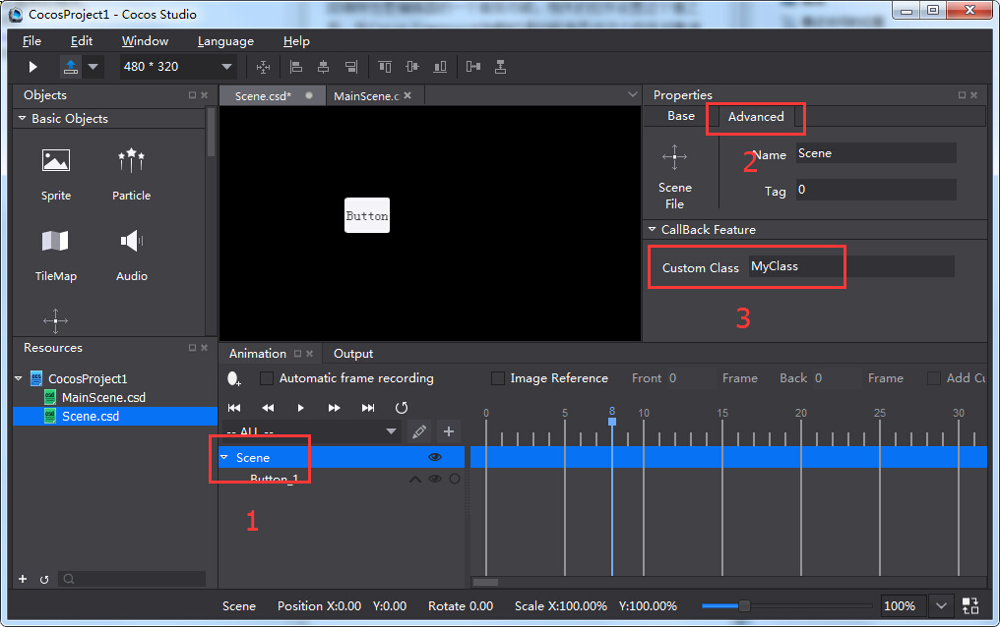
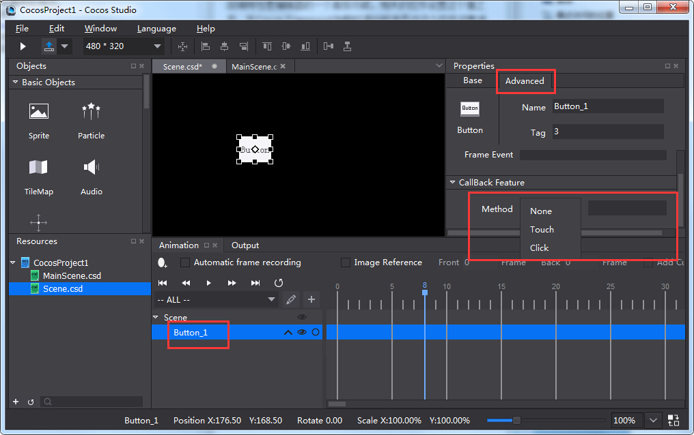

#3.2.4.4 回调特性
回调特性是编辑器的一个高级功能，相关的控件设置这个值之后，在Cocos Framework加载时通知程序员对这个控件对象进行相关的处理。  
使用这个功能需要设置两处地方。  
一个是自定义类类名。  

这个字段用于指定当前文件由哪个类处理。  
第二个是希望添加回调处理的控件的回调属性：

回调属性的类型有三种：  
1. Touch  
使控件监听一次完整的触摸事件，包括一次触摸的开始,移动,抬起或取消四种事件。   
2. Click  
使控件监听一次有效的触摸事件，相当于Touch事件的抬起。  
3. Event  
监听控件的特定触摸事件，不同控件有不同的事件类型。也有部分控件没有这个属性。    
    
以下列出了所有控件能够监听的Event事件：  
文本框（ui::TextField）  
&emsp;&emsp;ATTACH_WITH_IME//获得输入焦点  
&emsp;&emsp;DETACH_WITH_IME//失去输入焦点  
&emsp;&emsp;INSERT_TEXT//输入了文本  
&emsp;&emsp;DELETE_BACKWARD//删除了文字  
复选框（ui::CheckBox）  
&emsp;&emsp;SELECTED//勾选了复选框  
&emsp;&emsp;UNSELECTED//取消勾选了复选框  
滑动条（ui::Slider）  
&emsp;&emsp;ON_PERCENTAGE_CHANGED//百分比改变。  
滚动层（ui::ScrollView）  
&emsp;&emsp;SCROLL_TO_TOP//滚动到顶时触发。   
&emsp;&emsp;SCROLL_TO_BOTTOM//滚动到底时触发   
&emsp;&emsp;SCROLL_TO_LEFT//滚动到左边缘时触发   
&emsp;&emsp;SCROLL_TO_RIGHT//滚动到右边缘时触发   
&emsp;&emsp;SCROLLING,//滚动时触发   
&emsp;&emsp;BOUNCE_TOP//顶部回弹效果达到极限时触发   
&emsp;&emsp;BOUNCE_BOTTOM//底部回弹效果达到极限时触发   
&emsp;&emsp;BOUNCE_LEFT//左部回弹效果达到极限时触发   
&emsp;&emsp;BOUNCE_RIGHT//右部回弹效果达到极限时触发   
列表容器（ui::ListView）    
&emsp;&emsp;ON_SELECTED_ITEM_START,//点中某个项  
&emsp;&emsp;ON_SELECTED_ITEM_END//点中了某个项并抬起（没有发生滑动）  
翻页容器（ui::PageView）  
&emsp;&emsp;TURNING//滚动到了某页  