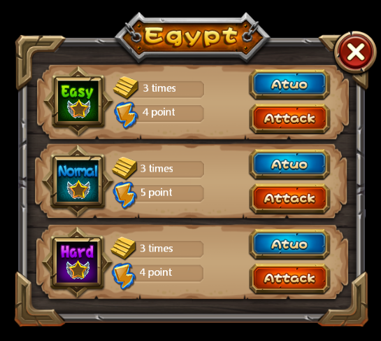
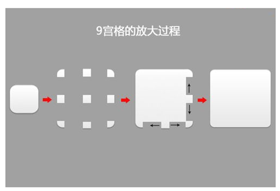

# 3.2.4.3 如何使用九宫格

使用九宫格能够帮助您节约大量资源空间，在官方示例中，很多地方使用了九宫格，如下面这张难度选择界面：

其深黄色背景就是使用一张仅有482字节大小的图片制作而成，制作方式如下：

####九宫格用法

(1) 在属性面板勾选开启使用九宫格功能（部分控件不具备该属性）

(2) 根据给出的尺寸属性，设置不失真的区域（如距左10像素，就是指控件从最左侧开始10像素内的图像不失真，若同时设置上下左右均为10像素，则不失真图像呈“回”字形）。

(3) 修改控件尺寸至您需要的大小即可。 

####九宫格原理
九宫格是一种能够使本来拉伸后会变形的图片，经过一定的处理后，拉伸后不变形的技术。

九宫格放大时四个角的四个切片向四个方向延伸，到达新的位置，然后上线两边的切片水平拉伸，左右两侧的切片垂直拉伸，中间的位图放大铺满剩余区域。

在Cocos Studio中可以定义需要确保不失真的上下左右边距，将剩余部分拉伸。需要注意的时，只有当用户选择自定义控件尺寸时控件，并启用九宫格时资源图片才能实现九宫格效果。
